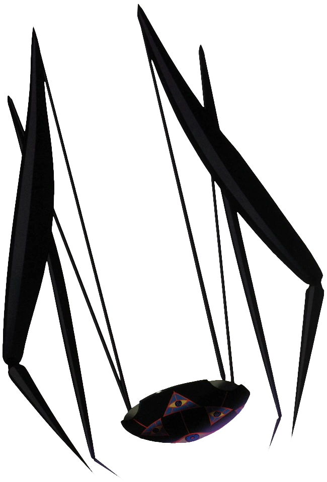
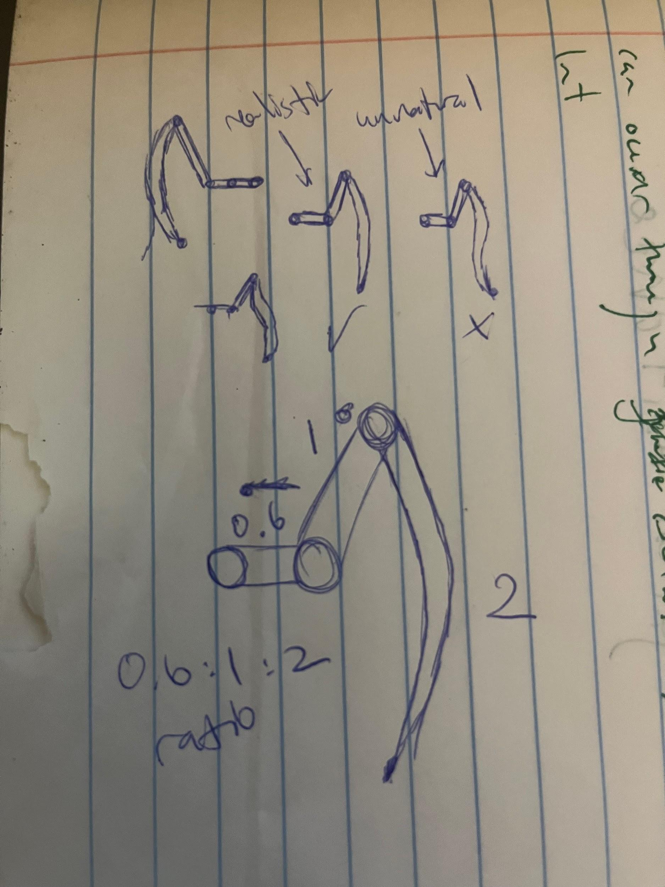
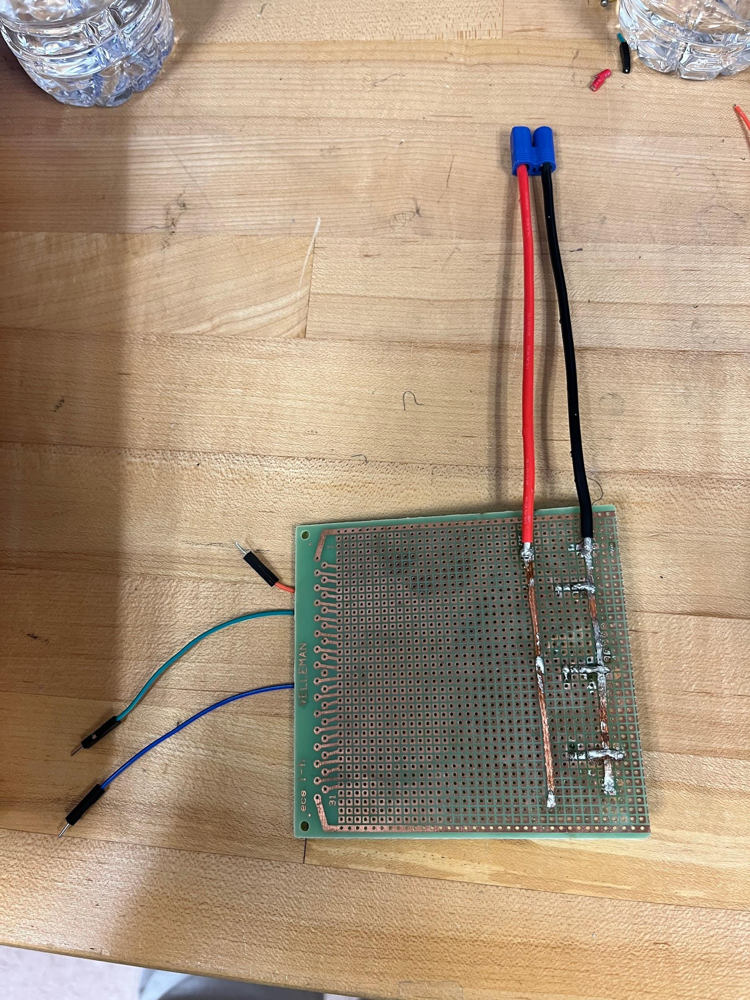
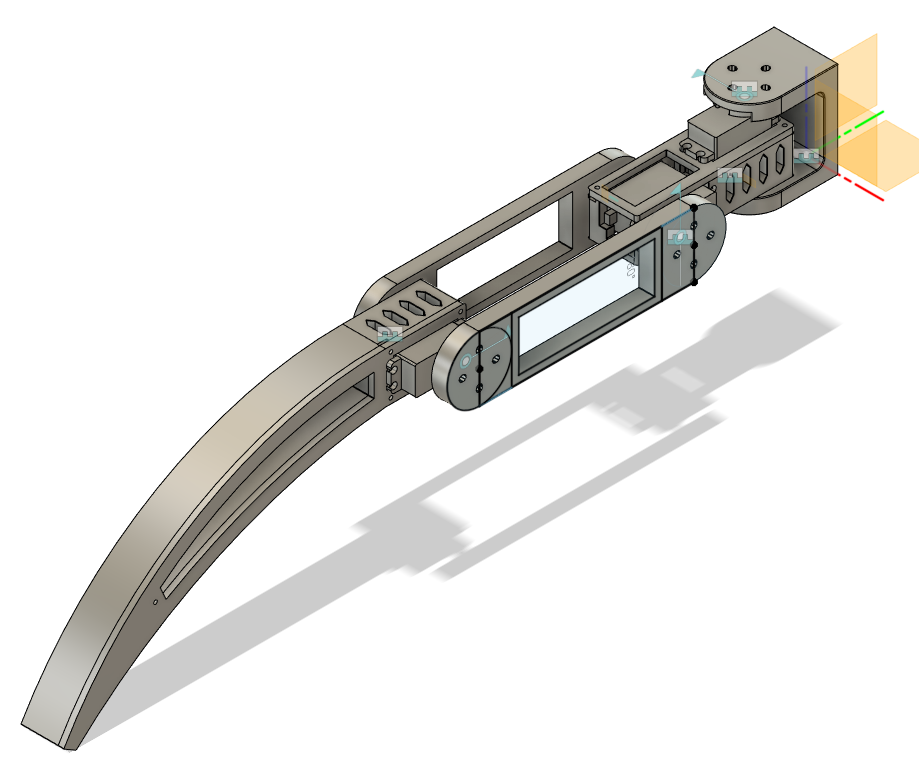

# December 29, 2024: Beginning the project

About a week ago, as winter break approached, I decided that I wanted to do a personal project for myself, to motivate chronic bum Logan to go out there and build something pretty cool, which is kind of why I pursued engineering in the first place. Now, after a week of bumming around, have I decided to begin. Now I begin to document my journey in building this and hopefully by the end of it, I'll have a super cool robot that I can show off (maybe to colleges?) (but also because it's cool).

So here's the gist of the idea I have:


I want to have the two robots work together. Maybe one's a bit stronger and has the platform to carry the robot with the arm. Or maybe I have two identical robots; that way their functions are interchangeable.

# January 1, 2025: Research links

Just adding some links for research:

[How to design and make a robot](https://www.youtube.com/watch?v=lKxJUViQsW8)

You know, designing a robot from scratch might be a really hard thing to do.

[Cool robot idea](https://www.reddit.com/user/KIKAItachi/)

# February 3, 2025: Leg and frame research

Been a long time since I came to this project, and now I'm doing research as to how I could possibly do this. ChatGPT is the new Google, you know, so not cheating.

Notes:

Lowkey the design we go for, and also figured out the design for what the legs should look like.




Hoping to figure out what the frame might look like and go from there. My next job should probably be figuring out what electronics I should be purchasing (servos, sensors, etc.). I should especially be worried about which sensors I would ACTUALLY NEED TO USE IN ORDER TO MAINTAIN SPIDER BALANCE.

# March 21-23, 2025: Beginning with one leg

Returned to this project and read up on how one would do this. The first step is to begin with a single-leg mechanism.

New Leg Design (ratios 0.6:1:1.6) (it's 1.6 instead of 2 because the arm is curved)




Look at how cute this is! Will be awesome when bro gets made.

March 23rd:

Just did a ton of research on what steps to take next. I haven't gotten around to starting the CAD, but I'm pretty sure I know of what servos to use. As part of servo research, I took this hand off of a Meccano robot I found in order to help me visualize how the leg would look.


Given that each servo is around 5.5cm at its widest + a couple of centimeters in order to build the housings, the coxa is at least ~14cm long. My ratios then have the femur as around ~23cm, and my tibia at around ~35cm (end to end, probably around ~38 actual length.

# March 30, 2025: Starting the servo CAD

I began CADing the servo motor; also, the servos themselves came in! Beautiful.


(Figuring out the dimensions was the hard part. I'm sure this will look nicer eventually.)

# April 3, 2025: Wiring and purchasing plan

At this point I know what I'm doing; exactly how to wire it, and what I need to purchase.

Arduino Nano, 7.4V 2S LiPo batteries, and now I just need to 3D print.

[OVONIC 2S LiPo battery](https://www.amazon.com/OVONIC-Battery-Trucks-Vehicles-Packs/dp/B0CHM2R7QJ)

# July 3, 2025: Working circuit and servo-holder redesign

It's been a while since I've revisited this doc, but I have plenty of updates to add!

I've purchased the batteries, and over these last few months, I created a working circuit for the prototype leg! I've been told that my design for the servo holder was lacking, so I'm revisiting it to redesign and hopefully print it soon.

The circuit



V2 of the servo holder


# July 23, 2025: Setting a concrete timeline

Exactly twenty days later and 0 progress has been made lol. So now, we're going to set some concrete timelines/project goals.


Here's to finishing it by September!

Hopefully, I can have a good design leg by next Wednesday.

Materials to purchase

- [2-56 square nuts](https://www.mcmaster.com/94855A279/)
- [2-56 screws](https://www.mcmaster.com/92949A079/)
- [M4 hex nuts](https://www.mcmaster.com/90591A255/)
- [M4 screws](https://www.mcmaster.com/92095A192/)
- [Servo hub](https://www.servocity.com/plastic-servo-hub-h25t-spline-32mm-diameter/)

# August 7, 2025: Full leg CAD and inverse kinematics

Big strides have been made. I've CAD-ed the entire leg, and it should be printed (and hopefully assembled) by next week. Now I take on the monumental task of creating the code and implementing inverse kinematics into the leg.

[Inverse Kinematics of Articulated Manipulator](https://www.youtube.com/watch?v=D93iQVoSScQ) - Used this to help determine the inverse kinematics


Volume of Leg:

- 1.883E+05 mm^3 - Tibia
- 92287.084 mm^3 - Femur
- 3152.098 mm^3 - Servo Hub (3)

Leg CAD:



Here's a snippet of some of the prototype Code:

```cpp
float t1 = atan2(y, x) * 180.0 / M_PI + 90;

p3 = acos(constrain((r3 * r3 - a2 * a2 - a3 * a3) / (-2.0 * a2 * a3)));

float t3 = 180.0 - (p3 * 180.0 / M_PI) - off;

p1 = acos(constrain((a3 * a3 - a2 * a2 - r3 * r3) / (-2.0 * a2 * r3)));

p2 = atan2(r2, r1);

float t2 = (p1 - p2) * 180.0 / M_PI;
```

Let's see if this works when I assemble everything next week.

# August 2025 - July 2026

During this period I put this project on the backburner, and worked on the project sporadically throughout my senior year.

But essentially, I:
- fixed my CAD design of the leg so that I could actually assemble it
- went through the trouble of assembling the leg
- vibe coded a controller that built off of my IK (inverse kinematics) math
- put it into action!


Here's also everything I've obtained that hasn't been mentioned already:

[Bearings](https://www.amazon.com/dp/B0G34JLXLK)

[DS3235 35KG Servo](https://www.amazon.com/dp/B07SBYZ4G5/)

Arduino Due (I swiped it from school)

**Total time spent: 60 hours** (somewhere between 60-100 hours from December 2024 - July 2026. I know this probably won't be counted but y'know, atleast know a lot of time was put into it)
